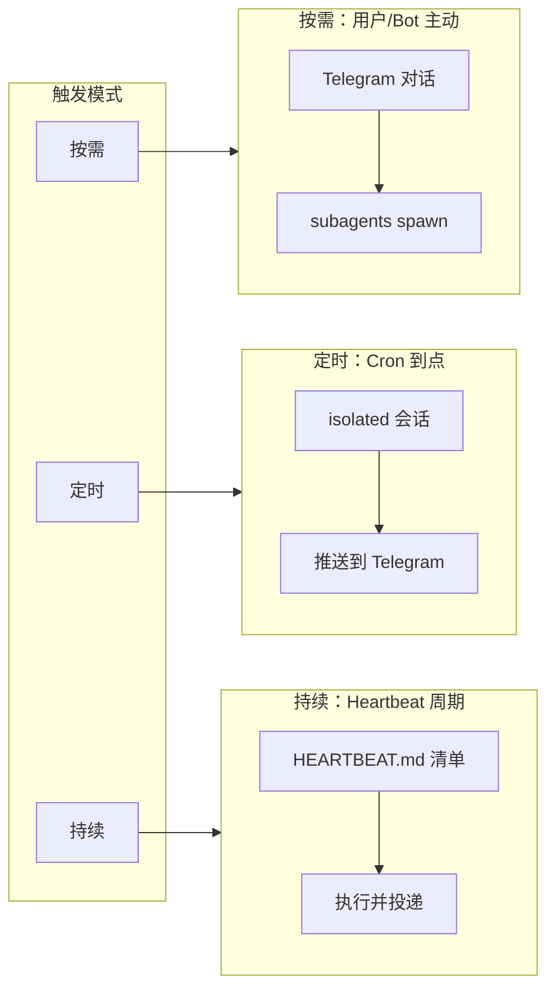
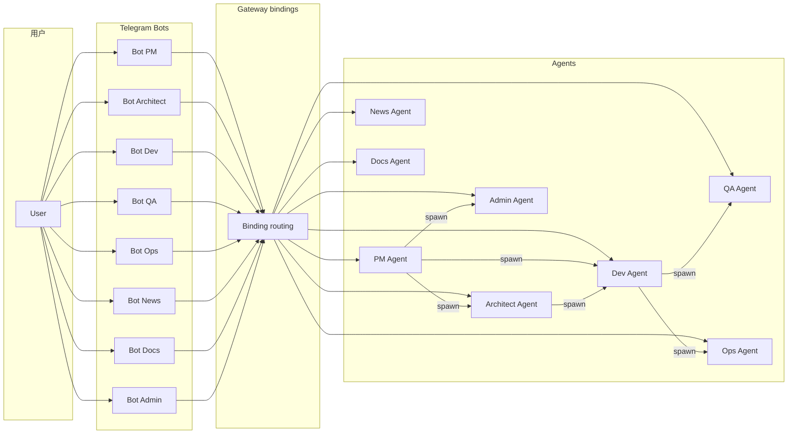
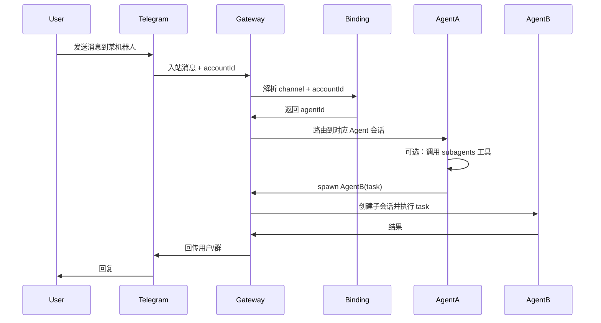
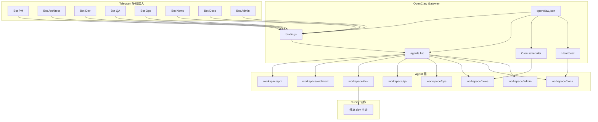

# OpenClaw AI Dev Team 完整触发架构

> 面向「真正可运行的 AI 软件开发团队」：8 个角色 Agent、Telegram 多机器人、定时/按需/持续触发，以及基于 Mac Mini + Cursor 的省 token 开发协作模式。

---

## 1. 概述与部署前提

### 1.1 部署环境

- **Gateway**：OpenClaw Gateway 部署在 **Mac Mini** 上，单实例运行。
- **渠道**：多个 Telegram 机器人通过 `channels.telegram.accounts` 配置，经 `bindings` 将每个 `accountId` 映射到对应 `agentId`。
- **配置**：主配置文件为 `~/.openclaw/openclaw.json`（或由 `OPENCLAW_CONFIG_PATH` 指定）。

### 1.2 Cursor 协作原则

为降低 Gateway 侧 LLM token 消耗，开发类重任务采用「OpenClaw 产出、Cursor 执行」的分工：

- **OpenClaw Agent**：负责需求拆解、规格说明、任务单或补丁草稿，将产出写入 **共享 workspace 或指定 dev 目录**。
- **Cursor**：在 Mac Mini 上打开该目录，由 Cursor 订阅完成实际编码与编辑，消耗 Cursor 侧配额而非 OpenClaw token。

推荐目录约定：`~/.openclaw/workspace/dev` 或 `~/.openclaw/workspace/<agentId>`（如 `workspace/dev` 供 Dev Agent 写入任务单）。

---

## 2. 八类 Agent 与完整职责表

| Agent           | 中文职称　　　 | 职责　　　　　　　　　　　　　　　　　　　　　　　　　　 | 运行模式 | 触发方式　　　　　　　　　　　　　 |
| -----------------| ----------------| ----------------------------------------------------------| ----------| ------------------------------------|
| PM Agent        | 产品经理　　　 | 需求拆解、产品规划、技术调研、功能路线图　　　　　　　　 | 按需　　 | Telegram 对话 / 被其他 Agent spawn |
| Architect Agent | 系统架构师　　 | 技术架构设计、技术选型、系统设计　　　　　　　　　　　　 | 按需　　 | 同上　　　　　　　　　　　　　　　 |
| Dev Agent       | 软件工程师　　 | 编写代码、实现功能、修复 Bug；可产出任务单由 Cursor 执行 | 按需　　 | 同上 + Cursor 协作　　　　　　　　 |
| QA Agent        | 测试工程师　　 | 测试用例、自动化测试、代码 Review　　　　　　　　　　　　| 按需　　 | 同上　　　　　　　　　　　　　　　 |
| Ops Agent       | 运维/DevOps　　| CI/CD、部署、监控、运维自动化　　　　　　　　　　　　　　| 按需　　 | 同上　　　　　　　　　　　　　　　 |
| News Agent      | 技术情报官　　 | 收集并推送 AI/云原生/开发技术新闻　　　　　　　　　　　　| 定时　　 | Cron 孤立会话 + 推送到 Telegram　　|
| Docs Agent      | 技术文档工程师 | 自动生成/维护 README、API 文档　　　　　　　　　　　　　 | 持续　　 | Heartbeat 或定时 Cron 检查待办　　 |
| Admin Agent     | 平台管理员　　 | OpenClaw 版本管理、新功能验证、配置咨询、健康排障　　　 | 按需　　 | Telegram 对话 / 被其他 Agent spawn |

### 2.1 各 Agent 完整职责说明

- **PM Agent（产品经理）**  
  **输入**：用户需求描述、市场/竞品信息。**输出**：需求文档、功能列表、优先级、路线图草稿。**与 Cursor 边界**：不直接写代码；产出规格供 Architect/Dev 使用。

- **Architect Agent（系统架构师）**  
  **输入**：需求或 PM 产出。**输出**：架构图、技术选型说明、模块划分、接口约定。**与 Cursor 边界**：可产出设计文档与接口定义；具体实现交由 Dev + Cursor。

- **Dev Agent（软件工程师）**  
  **输入**：需求/架构产出、Bug 描述、任务单。**输出**：代码补丁、任务单文件、实现说明；重实现可写入 `workspace/dev` 等目录由 Cursor 完成。**与 Cursor 边界**：轻量修改在 OpenClaw 内完成；大块编码以任务单形式输出，在 Cursor 中执行。

- **QA Agent（测试工程师）**  
  **输入**：功能说明、代码路径。**输出**：测试用例、自动化脚本建议、Review 结论。**与 Cursor 边界**：可产出测试脚本草稿；复杂脚本可在 Cursor 中完善。

- **Ops Agent（运维/DevOps）**  
  **输入**：部署目标、监控需求、故障描述。**输出**：CI/CD 配置建议、运维脚本、告警规则。**与 Cursor 边界**：脚本与配置可写入 workspace，必要时在 Cursor 中编辑。

- **News Agent（技术情报官）**  
  **输入**：定时触发（无用户输入）。**输出**：技术资讯摘要、链接列表，推送到指定 Telegram 会话/群。**与 Cursor 边界**：无；纯推送与摘要。

- **Docs Agent（技术文档工程师）**  
  **输入**：Heartbeat 或 Cron 触发、workspace 内代码/变更。**输出**：更新的 README、API 文档、变更日志。**与 Cursor 边界**：文档写入 workspace，可在 Cursor 中二次润色。

- **Admin Agent（平台管理员）**  
  **输入**：OpenClaw 配置、版本、健康检查请求。**输出**：升级建议、新功能摘要、配置说明、排障指引。**与 Cursor 边界**：不修改应用代码；仅产出建议与文档。区别于 Ops（管产品 CI/CD）和 QA（测产品），Admin 专注 OpenClaw 平台本身。

---

## 3. 每个 Agent 的触发方式（详细）

### 3.1 按需 Agent（PM / Architect / Dev / QA / Ops / Admin）

- **用户 → Telegram → Agent**  
  用户在对应角色的 Telegram 机器人对话中发送消息；Gateway 根据 `bindings` 将 `channel: telegram` + 该机器人的 `accountId` 解析为 `agentId`，消息进入该 Agent 的会话。

- **Agent → Agent（subagents）**  
  任一 Agent 可通过 **subagents 工具** 或 **Telegram 命令** 发起子任务：  
  - 命令格式：`/subagents spawn <agentId> <task>`（可选 `--model`、`--thinking`）。  
  - 工具等价：调用 Gateway 的 `agent` 方法，传入目标 `sessionKey`（对应子 agent 会话）、`message` 为任务内容。  
  实现见：`src/auto-reply/reply/commands-subagents/action-spawn.ts`、`src/agents/tools/subagents-tool.ts`。

### 3.2 News Agent（定时）

- **Cron 孤立会话**：使用 Gateway 的 Cron 调度，创建 `sessionTarget: "isolated"` 的定时任务，绑定 `agentId: "news"`，payload 为 `agentTurn`，`message` 为「收集并摘要 AI/云原生/开发技术新闻」等提示；`delivery.mode: "announce"`，`delivery.channel: "telegram"`，`delivery.to` 为目标 chat（如用户或群 ID）。
- **CLI 示例**（概念）：  
  `openclaw cron add --name "News digest" --cron "0 8 * * *" --tz "Asia/Shanghai" --session isolated --agent news --message "收集并推送今日技术资讯摘要" --announce --channel telegram --account news --to <chatId>`  
  实际参数以 [Cron Jobs](https://docs.openclaw.ai/automation/cron-jobs) 与 Gateway cron 工具 schema 为准（如 `schedule.kind`、`delivery.to` 格式）。

### 3.3 Docs Agent（持续）

- **Heartbeat**：在 `agents.list` 中为 Docs Agent 配置 `heartbeat.every`（如 `1h`），在该 Agent 的 workspace 内放置 `HEARTBEAT.md`，内容为「检查待更新文档、生成/更新 README/API 文档」等清单；每次心跳时 Agent 按清单执行并回复，若非 `HEARTBEAT_OK` 则按配置投递到 `target`（如 Telegram）。参见 [Heartbeat](https://docs.openclaw.ai/gateway/heartbeat)。
- **Cron 备选**：使用 isolated cron 定期（如每日）跑「文档检查与生成」任务，`delivery` 到 Telegram 或指定频道。

---

## 4. Agent 触发关系图

### 4.1 定时 / 按需 / 持续 触发模式总览



### 4.2 Agent 与 Telegram 多 Bot 路由关系（Mermaid）



### 4.3 按需调度流程（Mermaid）



---

## 5. Agent 调度流程（文字）

- **用户发起**：用户在某 Telegram 机器人处发消息 → Gateway 收包 → 按 `bindings` 解析出 `agentId` → 消息进入该 Agent 主会话（或已有线程）→ Agent 回复可经同一 channel 回传。
- **定时触发**：Cron 到点触发 → 若为 isolated，Gateway 以 `cron:<jobId>` 会话、绑定到的 `agentId`（如 news）执行一次 agent turn → 根据 `delivery` 将摘要/结果推到 Telegram 等。
- **心跳触发**：Heartbeat 按 `every` 间隔触发 → 在对应 Agent 主会话中注入心跳 prompt（含 HEARTBEAT.md 指引）→ Agent 若回复非 `HEARTBEAT_OK` 且内容超过 ack 阈值，则按 `target` 投递。

**子 Agent 调用链示例**：PM 拆需求 → 使用 subagents 工具 spawn Architect 做架构设计 → 再 spawn Dev 做实现；Dev 将任务单或补丁写入 `workspace/dev`，文档中建议开发者在 Cursor 中打开该目录完成编码，以节省 token。

---

## 6. OpenClaw Workflow 架构图

### 6.1 Workflow 总览（Mermaid）



- **配置**：`~/.openclaw/openclaw.json` 中定义 `agents.list`、`bindings`、`channels.telegram.accounts`、cron 任务（或通过 cron 工具动态添加）、heartbeat。
- **Workspace**：建议每 Agent 使用独立目录，如 `~/.openclaw/workspace/<agentId>`；Dev 与 Cursor 共享目录可为 `~/.openclaw/workspace/dev`。

---

## 7. Telegram 多机器人协作模型

### 7.1 一机器人一角色

每个 Telegram Bot 对应一个 `accountId`，通过 `bindings` 绑定到固定 `agentId`，与 [配置多个 Telegram 机器人完整指南](/lab/telegram/multi-bots) 一致。

| Bot 名称（示例）　| accountId | agentId   | 用途　　　　 |
| -------------------| -----------| -----------| --------------|
| OpenClaw_PM_bot　 | pm        | pm        | 产品经理　　 |
| OpenClaw_Arch_bot | architect | architect | 系统架构师　 |
| OpenClaw_Dev_bot　 | dev       | dev       | 软件工程师　 |
| OpenClaw_QA_bot　  | qa        | qa        | 测试工程师　 |
| OpenClaw_Ops_bot　 | ops       | ops       | 运维/DevOps　|
| OpenClaw_News_bot  | news      | news      | 技术情报推送 |
| OpenClaw_Docs_bot  | docs      | docs      | 技术文档　　 |
| OpenClaw_Admin_bot | admin     | admin     | 平台管理　　 |

### 7.2 协作方式

- 用户在不同群或私聊中 @ 不同机器人，获得对应角色响应；或同一群内加入多个机器人，各自仅响应发给自己的消息（由 `allowFrom`、群权限控制）。
- 路由规则参见 [Channel Routing](https://docs.openclaw.ai/channels/channel-routing)：`bindings[].match.accountId` 精确匹配后选定 `agentId`。

---

## 8. Cursor 与 OpenClaw 的协作（省 Token 开发）

### 8.1 问题

若所有编码都在 OpenClaw 内由 LLM 完成，Gateway 侧 token 消耗大。

### 8.2 方案

- **Dev Agent**（及必要时 QA/Architect）只做需求拆解、规格说明、任务单或补丁草稿，将产出写入 **共享 workspace 或指定 dev 目录**。
- 在 **Mac Mini 上用 Cursor** 打开该目录，由 Cursor 订阅完成实际编码与编辑，消耗 Cursor 侧配额。

### 8.3 落地方式

- **目录约定**：例如 `~/.openclaw/workspace/dev` 或 `~/.openclaw/workspace/<project>/tasks`。Dev Agent 的 SOUL/TOOLS 中约定：将「任务描述 + 文件路径/补丁」写入该目录。
- **文档约定**：在团队内说明「开发者在本机 Cursor 中打开该目录并交予 Cursor 完成实现」。
- **可选**：若需在 Mac Mini 上自动执行脚本（如写入任务文件、触发本地脚本），可使用 Gateway 的 **node.invoke**（如 `system.run`）或 **node host**，使 Agent 通过节点在 Mac 上执行命令；参见 [node](https://docs.openclaw.ai/cli/node)、[nodes](https://docs.openclaw.ai/nodes/index)。Cursor 无官方「被 OpenClaw 调用」的 API，本架构采用「文件/目录协作」模式，不承诺 Cursor 官方集成。

---

## 9. 配置清单（可运行最小配置）

以下为概念性最小配置，实际需按环境（token、目录、chatId）替换。

### 9.1 agents.list

```json
{
  "agents": {
    "defaults": {
      "workspace": "~/.openclaw/workspace",
      "heartbeat": { "every": "0m" }
    },
    "list": [
      { "id": "pm", "name": "产品经理", "workspace": "~/.openclaw/workspace/pm", "default": true },
      { "id": "architect", "name": "系统架构师", "workspace": "~/.openclaw/workspace/architect" },
      { "id": "dev", "name": "软件工程师", "workspace": "~/.openclaw/workspace/dev" },
      { "id": "qa", "name": "测试工程师", "workspace": "~/.openclaw/workspace/qa" },
      { "id": "ops", "name": "运维工程师", "workspace": "~/.openclaw/workspace/ops" },
      { "id": "news", "name": "技术情报官", "workspace": "~/.openclaw/workspace/news" },
      { "id": "docs", "name": "技术文档工程师", "workspace": "~/.openclaw/workspace/docs", "heartbeat": { "every": "1h", "target": "last" } },
      { "id": "admin", "name": "平台管理员", "workspace": "~/.openclaw/workspace/admin" }
    ]
  }
}
```

### 9.2 bindings

```json
{
  "bindings": [
    { "agentId": "pm", "match": { "channel": "telegram", "accountId": "pm" } },
    { "agentId": "architect", "match": { "channel": "telegram", "accountId": "architect" } },
    { "agentId": "dev", "match": { "channel": "telegram", "accountId": "dev" } },
    { "agentId": "qa", "match": { "channel": "telegram", "accountId": "qa" } },
    { "agentId": "ops", "match": { "channel": "telegram", "accountId": "ops" } },
    { "agentId": "news", "match": { "channel": "telegram", "accountId": "news" } },
    { "agentId": "docs", "match": { "channel": "telegram", "accountId": "docs" } },
    { "agentId": "admin", "match": { "channel": "telegram", "accountId": "admin" } }
  ]
}
```

### 9.3 channels.telegram.accounts

每个 accountId 一项，包含 `enabled`、`botToken`、`allowFrom`、`dmPolicy`、`proxy`（如需）等，结构与 [配置多个 Telegram 机器人完整指南](/lab/telegram/multi-bots) 中一致。

### 9.4 Cron（News 示例）

通过 `openclaw cron add` 或 Gateway cron 工具添加孤立会话任务，例如：

- `schedule.kind: "cron"`，`expr: "0 8 * * *"`，`tz: "Asia/Shanghai"`。
- `sessionTarget: "isolated"`，`payload.kind: "agentTurn"`，`message`: 收集并推送技术资讯的提示。
- `agentId: "news"`。
- `delivery.mode: "announce"`，`delivery.channel: "telegram"`，`delivery.to`: 目标 chat ID（如 `-100xxxxxxxxxx` 或用户 ID）。

### 9.5 Heartbeat（Docs）

在 `agents.list` 中为 `docs` 配置 `heartbeat.every`（如 `1h`）、`heartbeat.target`（如 `last`）；在 `workspace/docs` 下放置 `HEARTBEAT.md`，内容为文档检查与生成清单。

### 9.6 Default agent

建议将 `pm` 或 `main` 设为 `default: true`，以便未匹配到更具体 binding 时的回退。

---

## 10. 参考与延伸

- [平台管理员 Agent 工作区引导文件定制指南](/lab/setup/workspace/admin)
- [Multi-Agent Routing](https://docs.openclaw.ai/concepts/multi-agent)
- [Channel Routing](https://docs.openclaw.ai/channels/channel-routing)
- [Cron Jobs](https://docs.openclaw.ai/automation/cron-jobs)
- [Cron vs Heartbeat](https://docs.openclaw.ai/automation/cron-vs-heartbeat)
- [Heartbeat](https://docs.openclaw.ai/gateway/heartbeat)
- [Telegram](https://docs.openclaw.ai/channels/telegram)
- [配置多个 Telegram 机器人完整指南](/lab/telegram/multi-bots)
- [node（headless node host）](https://docs.openclaw.ai/cli/node)
- [Nodes](https://docs.openclaw.ai/nodes/index)

**声明**：本文档为架构与设计说明，实际配置需按环境（token、目录、Mac Mini 网络、Telegram chatId）调整。Cursor 协作为推荐模式，非 OpenClaw 内置集成。
