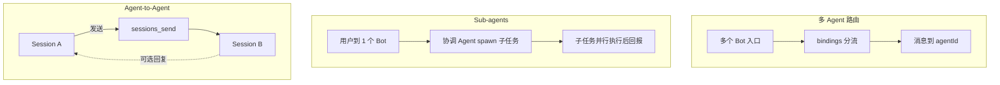

# 别再把多 Bot 和多 Agent 搞混了：OpenClaw 协作全景与落地 Demo

> 面向经常把 `subagents`、`agent-to-agent`、`多个 bot 分工`混在一起的用户。本文给你一套可执行的判断框架：**先分清机制，再选架构，再做最小可用落地**。

## 背景：我为什么写这篇

前两天我和“产品经理机器人”聊多智能体协作，聊着聊着就卡住了：  
我到底该做“一个 PM bot + 多个内部 agent”，还是“每个角色都配一个 bot”？  
`subagents`、`agent-to-agent`、`multi-agent routing` 看起来都像“协作”，但实际用法和成本完全不同。

如果你也有同样困惑——比如：

- 想提高开发效率，但不想把系统复杂度拉满
- 不确定什么时候该上多个 bot
- 担心在 Telegram/飞书群里做 bot 互 @ 会踩坑

那这篇就是写给你的。目标很直接：**10 分钟读完，能做出正确架构选择**。

---

## 一、先给结论：这三件事不是一回事

在 OpenClaw 里，常见“多智能体协作”其实有 3 层机制：

1. **多 Agent 路由（Multi-agent routing）**
   - 解决的是「**入口分流**」：哪条入站消息由哪个 agent 接。
   - 常见形态：一个或多个 bot 账号，按 `bindings` 路由到不同 agent。
   - 关键词：`agents.list`、`bindings`、`accountId`、`peer`。

2. **子代理（Sub-agents，`sessions_spawn`）**
   - 解决的是「**并行执行**」：当前 agent 在后台拉起子任务，做完后回报。
   - 常见形态：用户只对话一个“协调者”，协调者内部并发调度多个子任务。
   - 关键词：`sessions_spawn`、`maxConcurrent`、`maxSpawnDepth`、announce。

3. **Agent-to-Agent（会话互发，`sessions_send`）**
   - 解决的是「**会话间通信**」：把消息发到另一个 session（可跨 agent），可有回合往返。
   - 常见形态：两个长期会话互相协作，偏“协议化对话”。
   - 关键词：`sessions_send`、`tools.agentToAgent`、`maxPingPongTurns`。

**一句话区分：**
- 多 Agent 路由 = “谁对外接活”
- Sub-agents = “谁在后台干活”
- Agent-to-Agent = “两个会话如何互相发消息”

### 三种机制对比图



---

## 二、你当前的认知是否正确？

你说的“一个项目开发，多 agent 协作，不一定是 bot 给 bot 下指令，而是一个 bot 对接多个 agent 干活”，在 OpenClaw 语境里是**完全成立且推荐的起步架构**。

更具体地说：

- 你可以只保留 **1 个 PM bot（协调入口）**。
- PM 在同一会话内通过 `sessions_spawn` 分派并行子任务（需求、架构、前端、后端、测试）。
- 用户只和 PM 对话，专业 agent 在后台完成并汇总。

这比一开始就上“5 个 bot 对外”更易控、成本更低、治理更简单。

---

## 三、什么时候用哪种机制（决策表）

| 需求 | 机制 | 是否需要多个 bot |
|---|---|---|
| 我只想一个入口，内部并行拆任务 | `sessions_spawn`（Sub-agents） | 不需要 |
| 不同团队/群聊要不同人格、不同权限、不同账号 | Multi-agent routing | 常需要 |
| 两个长期会话要结构化互发信息/回合讨论 | `sessions_send`（Agent-to-Agent） | 不一定 |
| 我只想“让某个 agent 跑一轮并可投递” | `openclaw agent`（Agent Send） | 不需要 |

**经验法则：**

- 个人用户：先 **1 bot + subagents**。
- 小团队：入口仍可 1 bot，但可按需要增加 1–2 个专业 bot。
- 组织级隔离：多 bot + 多 agent + 明确 bindings。

从工程视角再补一条硬核理由：  
**拆 agent 不只是为了“分工”，更是为了“上下文压缩”**。  
一个 agent 全包所有角色时，系统提示词和历史会越来越臃肿，模型更容易遗忘约束、推理漂移、成本上升。把任务用 `sessions_spawn` 拆给专业 agent，相当于把上下文按职责切片，通常会更稳、更便宜。

### 3.1 什么时候“必须考虑多个 bot”

如果你遇到下面任意 2 条，基本就该上多个 bot 了：

- **多人共用**：不同人/不同团队同时在用，同一个 bot 容易串话、串上下文。
- **要隔离责任**：比如“客服 bot”和“研发 bot”必须分开，避免误发和误操作。
- **要隔离权限**：某个 bot 只允许查信息，另一个 bot 才能执行高风险动作。
- **要隔离身份**：你希望在 Telegram/飞书里显示不同机器人身份（名字、头像、账号）对接不同场景。
- **要隔离成本与模型**：高价值入口用高质量模型，普通入口用便宜模型。

如果你是个人开发者，且主要诉求是“做事更快”，通常先不用多个 bot，先把 **1 个 PM bot + subagents** 跑顺。

### 3.2 配置核心关系：`channels`、`accounts`、`bindings`、`agents`

这 4 个概念不分清，最容易误配：

- `channels`：渠道类型（telegram/feishu/discord...）
- `channels.<channel>.accounts`：这个渠道下的“机器人账号实例”（可理解为 bot 身份）
- `agents.list`：AI 大脑（工作区、会话、规则、技能）
- `bindings`：把“哪路入站消息”路由到“哪个 agent”

可以记成一句话：

**bot 负责接消息，agent 负责思考，bindings 负责连线。**

最小关系图（逻辑上）：

```text
用户消息 -> channel/account(bot) -> binding 匹配 -> agentId -> 对应 agent 执行
```

再强调一次，避免误导：

- **bot != agent**
- 一个 bot 可以只绑定一个 agent（最常见）
- 也可以多个 bot 绑定同一个 agent（多个入口共用一个大脑）
- 也可以一个渠道内多个 account 分别绑定不同 agent（多角色隔离）

### 3.3 每个 agent 还能配置什么（实用清单）

如果你在做多 agent，`agents.list[]` 里每个 agent 常用可配项有这些：

- `id`：唯一标识（必填）
- `default`：是否默认 agent
- `name`：展示名
- `workspace`：该 agent 的文件工作区（代码、文档、产物）
- `agentDir`：该 agent 的状态目录（认证、会话状态等）
- `model`：该 agent 默认模型（可配主模型+回退）
- `params`：模型参数覆盖（如 temperature、maxTokens）
- `identity`：身份信息（name/theme/emoji/avatar）
- `groupChat`：群聊规则（例如 mentionPatterns）
- `subagents`：子代理策略（常用 `allowAgents`、`model`）
- `tools`：工具权限策略（`profile/allow/deny/elevated`）
- `sandbox`：沙箱策略（是否沙箱、scope、workspaceAccess）
- `skills`：该 agent 可用技能清单
- `memorySearch`：记忆检索配置
- `heartbeat`：该 agent 的心跳任务配置

你可以先记一条“起步最小集”：

- `id`
- `workspace`
- `model`
- `identity`
- `tools`
- `subagents.allowAgents`

一个可复制的最小示例：

```json5
{
  agents: {
    list: [
      {
        id: "pm",
        default: true,
        workspace: "~/.openclaw/workspace-pm",
        model: "anthropic/claude-sonnet-4-6",
        identity: { name: "PM Bot", emoji: "🧭" },
        tools: {
          profile: "coding",
          deny: ["gateway"], // 例子：先禁高风险工具
        },
        subagents: {
          allowAgents: ["req", "arch", "fe", "be", "qa"],
        },
      },
      { id: "req", workspace: "~/.openclaw/workspace-req", model: "openai/gpt-5.2-codex" },
      { id: "arch", workspace: "~/.openclaw/workspace-arch", model: "anthropic/claude-opus-4-6" },
    ],
  },
}
```

这段配置表达的是：

- `pm` 是“协调大脑”
- `req/arch/...` 是“专业大脑”
- 真正的 bot 入口还在 `channels.<channel>.accounts`，通过 `bindings` 把入口接到 `pm`

### 3.4 关键纠正：`workspace` 和 `agentDir` 不是一回事

很多人把这两个路径配反，结果协作异常。你可以这样理解：

- `workspace` = 文件空间（代码/文档产出）
- `agentDir` = 状态空间（会话、认证、运行状态）

实战建议：

- **协作开发场景**：如果你希望 PM 能直接看到子 agent 产出的代码，相关 agent 应该共享同一代码仓库视图（同一 `workspace` 或同仓不同子目录）。
- **状态隔离场景**：`agentDir` 要保持隔离，避免状态串扰。

一句话：  
**可以共享文件视图，不要共享状态目录。**

### 3.5 `bindings` 没有 `priority` 字段，但有“匹配优先级”

OpenClaw 的 `bindings` 不是靠 `priority: 1/2/3` 这种字段排序，而是：

1. 先按匹配“具体程度”决策（peer/guild/team/account/channel）
2. 同一层级冲突时，按配置顺序“先出现先命中”
3. 都没命中时，回退到默认 agent（`default: true`，若多个则取首个）

所以配置时建议：

- 只设置一个 `default: true`
- 把更具体的绑定写在前面
- 用 `openclaw agents bindings` 持续核对路由结果

---

## 四、一个高频误区：群里让机器人互相 @ 对话，行不行？

先说结论：**不建议把“bot 对 bot 互聊”当主方案**，尤其在 Telegram/飞书群组里。

### 4.1 Telegram：群组里基本不可依赖，频道里才可能

- 在 OpenClaw 的 Telegram 处理逻辑里已明确说明：**Telegram bot 在群组里看不到其他 bot 的消息**，但在频道（channel）可以处理 `channel_post`。
- 这不是 OpenClaw 单独限制，底层是 Telegram Bot API 的事件可见性约束（常见与 Privacy Mode 一起表现出来）。即使两个 bot 都是管理员，也通常无法形成稳定闭环互聊。

所以：在 Telegram 群组里，设计“机器人 A @ 机器人 B 然后 B 自动回”通常不稳定或直接不可行；如果一定要 bot-to-bot，只有频道路径更有机会。

### 4.2 飞书（Lark）：工程上不推荐走 bot 互聊链路

- 飞书插件当前主路径是“用户消息触发 + @ 提及 + 路由策略”，不是“bot 消息驱动 bot”。
- 配置层也没有像 Discord/Slack 那样的 `allowBots` 开关用于放开 bot-authored 消息触发，说明它不是默认设计目标。
- 在企业群里强行做 bot 互聊，还会带来循环触发、噪声刷屏、成本不可控。

### 4.3 有必要做机器人互相 @ 吗？

多数场景 **没有必要**。更稳妥的做法是：

- 对外：一个协调入口 bot（PM）
- 对内：用 `sessions_spawn` 并行调度专业 agent
- 真要跨会话协作：再用 `sessions_send`（按白名单控制）

这比“群里机器人互相喊话”更可控、可审计、可维护。  
也可以理解为：**优先内存级通信（sessions），避免网络级互喊（群里互 @）**。

---

## 五、单人场景的推荐架构（最小可用）

### 5.1 你需要几个 bot？

- **阶段 1（推荐）**：1 个 bot（PM）就够。
- **阶段 2（可选）**：当你发现“你自己经常想直接找某个专家聊天”，再给专家加独立 bot。

### 5.2 你需要几个 agent？

建议从 3 个开始，而不是一口气 6 个：

- `pm`：协调、拆解、整合
- `builder`：实现（前后端都先放一起）
- `qa`：测试与验收

稳定后再拆：`builder -> frontend + backend`，再加 `arch`、`req`。

---

## 六、实战 Demo：1 个 PM bot + 5 个专业 agent（内部协作）

> 目标：你一个人开发“电商网站 MVP”。对外只有 PM bot；内部有需求/架构/前端/后端/测试 agent。

### 6.1 Agent 拓扑

- 对外入口：`pm`（唯一 bot）
- 内部专业 agent：`req`、`arch`、`fe`、`be`、`qa`

### 6.2 配置要点（核心片段）

```json5
{
  channels: {
    telegram: {
      accounts: {
        // 对外入口 bot（PM）
        pm: { botToken: "TELEGRAM_BOT_TOKEN_PM" },
        // 可选：专家 bot（你未来需要再开）
        // fe: { botToken: "TELEGRAM_BOT_TOKEN_FE" },
      },
    },
  },

  agents: {
    list: [
      { id: "pm", default: true, workspace: "~/.openclaw/workspace-pm" },
      { id: "req", workspace: "~/.openclaw/workspace-req" },
      { id: "arch", workspace: "~/.openclaw/workspace-arch" },
      { id: "fe", workspace: "~/.openclaw/workspace-fe" },
      { id: "be", workspace: "~/.openclaw/workspace-be" },
      { id: "qa", workspace: "~/.openclaw/workspace-qa" },
    ],
    defaults: {
      subagents: {
        maxConcurrent: 6,
        maxSpawnDepth: 2,
        runTimeoutSeconds: 900,
      },
    },
  },

  bindings: [
    // 关键：把 Telegram 的 pm 账号入口，绑定到 pm 这个 agent（对外一个入口）
    { agentId: "pm", match: { channel: "telegram", accountId: "pm" } },
  ],

  // 关键：允许 pm 定向 spawn 到指定 agentId
  // 若不设，默认通常只能 spawn 到自己
  //（也可在具体 agent 上单独配置 allowAgents）
}
```

> 这段配置里，`channels.telegram.accounts.pm` 是“机器人入口账号”，`agents.list[].id` 是“AI 大脑”。两者通过 `bindings` 连接。这样更不容易把 bot 和 agent 混为一谈。

### 6.3 PM 的编排提示词（示例）

你给 PM 的任务：

```text
开发一个电商网站 MVP：
- 先拆解为需求、架构、前端、后端、测试 5 个子任务
- 并行执行
- 统一输出：里程碑、风险、下一个可执行动作
```

PM 执行策略：

1. `sessions_spawn(agentId=req, task=...)`
2. `sessions_spawn(agentId=arch, task=...)`
3. `sessions_spawn(agentId=fe, task=...)`
4. `sessions_spawn(agentId=be, task=...)`
5. `sessions_spawn(agentId=qa, task=...)`
6. 汇总结果，给你一个“可发布的交付包”

### 6.3.1 少刷屏策略：可见协作 vs 静默协作

多 agent 协作最容易引发“消息刷屏焦虑”。推荐两种模式：

- **可见模式**：让用户看到阶段性进展（适合耗时任务）
- **静默模式**：后台完成后只发最终结果（适合短小任务）

实现层面说明（按当前 OpenClaw 机制）：

- `sessions_spawn` 本身是非阻塞，并带 announce 回传链路。
- 如果你要“静默”，不要依赖不存在的 `announce: false` 参数；应通过编排提示词约束 announce 输出（必要时使用 `ANNOUNCE_SKIP` 语义）并由 PM 统一对外口径。

### 6.4 什么时候引入 Agent-to-Agent（`sessions_send`）

仅在下面情况建议上：

- 你要让 `qa` 会话持续追问 `be` 会话，形成多轮自动对齐
- 你要跨会话异步协作，不只是一次性子任务

并且需要配置：

```json5
{
  tools: {
    sessions: { visibility: "all" },
    agentToAgent: {
      enabled: true,
      allow: ["pm", "qa", "be"],
    },
  },
  session: {
    agentToAgent: { maxPingPongTurns: 3 },
  },
}
```

如果你只是“任务拆分 + 回收结果”，**subagents 就够了**，不需要急着开 agent-to-agent。

### 6.5 防死循环：父子通信要有“终止协议”

新手常见坑是 agent 之间无意义确认来回（谢谢/收到/不客气），白白烧轮次。

建议在 `AGENTS.md` 增加硬规则：

- 每次回复必须包含“实质性产出”或“明确终止信号”
- 禁止纯礼貌回合
- 需要结束时输出统一终止词（例如 `TERMINATE` 或业务定义信号）

`session.agentToAgent.maxPingPongTurns` 是最后一道保险丝，但不是最优治理手段；最省钱的方案仍是前置规则。

### 6.6 模型混用：多 agent 的成本控制核心手段

一个好用的实战配比：

- **PM/协调 agent**：高质量模型（负责拆解、权衡、集成）
- **执行型 subagents**：按任务难度选择性价比模型（格式整理、基础检查、批量转换可用低成本模型）
- **高风险节点**（架构决策/最终验收）：再切回高质量模型

这就是多 agent 架构的关键优势之一：  
**不是所有环节都要用最贵模型。**

---

## 七、`SOUL.md`、`AGENTS.md`、`skills/` 到底怎么分工

这部分最容易踩坑：把所有规则都塞进 `SOUL.md`，结果提示词又长又乱。

### 7.1 `SOUL.md`：人格与边界（少而稳）

适合放：

- 角色身份（例如“你是技术项目经理”）
- 沟通语气（简洁/专业/偏业务）
- 红线边界（安全、合规、拒绝策略）

不适合放：

- 具体 SOP 流程细节
- 频繁变化的工具参数

### 7.2 `AGENTS.md`：运行规则与执行偏好（中等稳定）

适合放：

- 任务拆解策略
- 默认交付格式（先结论再行动项）
- 何时 spawn、何时直接回答

### 7.3 `skills/xxx/SKILL.md`：可复用“战术动作”（高复用）

适合放：

- 重复动作模板（比如“生成测试计划”“发布说明生成器”）
- 依赖某些工具或外部命令的固定流程
- 跨多个 agent 共用的能力包

**判断标准：**

- 这是“人格原则”吗？放 `SOUL.md`
- 这是“协作规则”吗？放 `AGENTS.md`
- 这是“可复用操作手册”吗？做成 `skills/*/SKILL.md`

---

## 八、常见误区与修正

### 误区 1：多 agent = 必须多 bot

不是。多 agent 可以纯内部协作，对外仍一个 bot。

### 误区 2：subagents 和 agent-to-agent 一样

不是。subagents 是“后台子任务”；agent-to-agent 是“会话间消息通信”。

### 误区 3：先把架构做满再用

建议反过来：先 1 bot + 2~3 agent 跑通，再按瓶颈拆分。

### 误区 4：所有个性化都写 SOUL

`SOUL` 只放稳定人格；流程和能力分别放 `AGENTS` 与 `skills`。

### 误区 5：多个 bot 就等于高级

不一定。很多情况下只是把系统复杂度提前了。  
先跑通“一个 bot + 内部分工”，再按真实痛点扩展，通常更快更稳。

---

## 九、你的一页落地路线图（个人开发者版）

1. **第 1 周**：1 个 PM bot，先启用 `sessions_spawn`，不启用 agent-to-agent。  
2. **第 2 周**：增加 `builder` + `qa` 两个内部 agent，固定输出模板。  
3. **第 3 周**：把高频动作沉淀成 2–3 个 skills。  
4. **第 4 周**：若出现“长期跨会话协商”需求，再小范围启用 `tools.agentToAgent`。  
5. **持续优化**：按成本和质量调模型（主协调高质量、子任务性价比模型）。

---

## 十、结语

如果你是“一个人做项目”，最佳起点通常不是“多 bot 群聊编队”，而是：

- **一个协调入口（PM bot）**
- **多个内部专业 agent（subagents 并行）**
- **必要时再引入 agent-to-agent**

这条路径兼顾了上手速度、成本和可维护性，也最符合 OpenClaw 的工程化演进方式。

避坑金句：

> 把 Bot 当成你的手机号（入口），把 Model 当成思考引擎（大脑），把 Agent 当成带记忆与规则的执行岗位（手+流程）。  
> 你可以用一个手机号按事情转接给不同 Agent，也可以给每个 Agent 配独立专线（多 Bot）。  
> 但除非你想把内部协作过程公开展示，否则优先用 `sessions_spawn` 做内部传球，而不是在群里互相 `@`。

如果文中有理解偏差、版本差异，或你有更好的工程实践，欢迎各位大佬指出和补充。  
我会持续修订这篇文章，让它更准确、更好用。

---

## 十一、参考链接

- OpenClaw 文档首页：[https://docs.openclaw.ai/](https://docs.openclaw.ai/)
- Multi-agent routing：[https://docs.openclaw.ai/concepts/multi-agent](https://docs.openclaw.ai/concepts/multi-agent)
- Sub-agents：[https://docs.openclaw.ai/tools/subagents](https://docs.openclaw.ai/tools/subagents)
- Session tools（`sessions_send` / `sessions_spawn`）：[https://docs.openclaw.ai/concepts/session-tool](https://docs.openclaw.ai/concepts/session-tool)
- Agent Send：[https://docs.openclaw.ai/tools/agent-send](https://docs.openclaw.ai/tools/agent-send)
- Skills：[https://docs.openclaw.ai/tools/skills](https://docs.openclaw.ai/tools/skills)
- Agent workspace：[https://docs.openclaw.ai/concepts/agent-workspace](https://docs.openclaw.ai/concepts/agent-workspace)
- Anthropic（行业参考）：[https://www.anthropic.com/](https://www.anthropic.com/)
- OpenAI（行业参考）：[https://openai.com/](https://openai.com/)
